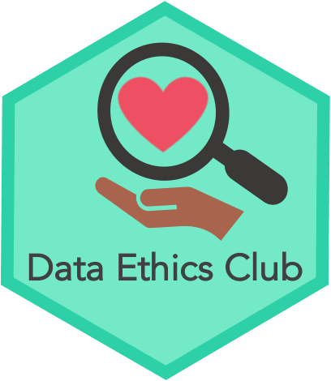

# Data Ethics Club
<!-- ALL-CONTRIBUTORS-BADGE:START - Do not remove or modify this section -->

<!-- ALL-CONTRIBUTORS-BADGE:END -->

  

Welcome! Data Ethics Club is a discussion group/"journal" club about doing data science ethically. "Journal" because we will also read blog posts, (parts of) books, or watch videos. The organisers are based in Bristol, but the club is open to all. To [stay in the loop](#stay-in-the-loop), please join our [mailing list](http://eepurl.com/hjkmnX). You can see the dates of our upcoming meetings [here](./MEETINGS.md).

While you're here, you may also want to:
* enjoy our [reading list](#reading-list).
* [suggest reading materials](#how-to-make-suggestions).
* [get involved in organising](#get-involved).

## Stay in the loop

The main way to keep informed about [upcoming meetings](./MEETINGS.md) is to join our :sparkles: :arrow_right: [**Data Ethics Club Mailing List**](http://eepurl.com/hjkmnX) :arrow_left: :sparkles: !

In addition to the [mailing list](http://eepurl.com/hjkmnX) (which is the main way to stay in the loop), we will also advertise meetings:
- Through the [Jean Golding Institute mailing list](https://www.bristol.ac.uk/golding/join-our-mailing-list/) - where you can also hear about other Data Science Events.
- By putting the dates [right here in this repository](./MEETINGS.md).
- We'll [tweet about it at #DataEthicsClub](https://twitter.com/hashtag/DataEthicsClub?src=hashtag_click).

## How to join our next meeting
Either:
- Go to [this file](./MEETINGS.md) and click on the date you want to join - all the details are there
- OR [join the mailing list](http://eepurl.com/hjkmnX) to receive a "1 week reminder" and an "it's today!" reminder.

## Get Involved
If you're interested in joining us in organising, please ping us an [email](mailto:grp-ethicaldatascience@groups.bristol.ac.uk)

### Organisers
You can also contact us separately:
- Nina Di Cara - [twitter](https://twitter.com/ninadicara), [email](mailto:nina.dicara@bristol.ac.uk)
- Natalie Thurlby - [twitter](https://twitter.com/StatalieT), [email](mailto:natalie.thurlby@bristol.ac.uk)

## How to make suggestions
If you'd like to make a suggestion for what to read, please do whatever you'd prefer:
* [make an issue](https://github.com/very-good-science/ethical-data-science-journal-club/issues/new/choose) - use the reading suggestion(s) template.
* [email us](mailto:grp-ethicaldatascience@groups.bristol.ac.uk)
* edit this README and make a Pull Request (PR)

## Reading list
- 🕰️ = waiting for paper to drop
- :white_check_mark: = we've read it
- 📺 = Watching/Listening material
- [1] = A longer piece of work, we'd need to choose a chapter or section.
- [2] = A shorter piece of work, perhaps to combine with something else

These are rough categories, reading materials appear once in the category we felt they fit best. 
We welcome suggestions for new categories, or moving materials between categories (please [open an issue](https://github.com/very-good-science/data-ethics-club/issues/new), or [email us](mailto:grp-ethicaldatascience@groups.bristol.ac.uk)).

### What is data ethics?

* [Introduction to Research Ethics](https://the-turing-way.netlify.app/ethical-research/ethics-intro.html) - suggested by [@leriomaggio](https://github.com/leriomaggio)
* [What is Data Ethics?](https://royalsocietypublishing.org/doi/10.1098/rsta.2016.0360)1
* [Ethical data science](https://arxiv.org/pdf/1411.1373.pdf)1
* [Algorithmic Injustices: Towards a relational ethics](https://arxiv.org/abs/1912.07376) - suggested by [@RobertArbon](https://github.com/RobertArbon), [:white_check_mark: 3rd March 2021](meetings/2021/03-march/03-03-21_meeting.md)

* [Ethical principles in machine learning and artificial intelligence: cases from the field and possible ways forward](https://www.nature.com/articles/s41599-020-0501-9) 
* [Ethics can't be a side hustle](https://deardesignstudent.com/ethics-cant-be-a-side-hustle-b9e78c090aee) - :white_check_mark: [3rd Feb 2021](./meetings/2021/02-feb/03-02-21_meeting.md)
* [Reflections on trusting trust](http://users.ece.cmu.edu/~ganger/712.fall02/papers/p761-thompson.pdf)

* 📺 [21 Fairness Definitions and their politics](https://www.youtube.com/watch?v=jIXIuYdnyyk) - suggested by [@NatalieThurlby](https://github.com/NatalieThurlby)

* 📺 [AI, Ain’t I a Woman?](https://www.youtube.com/watch?v=HZxV9w2o0FM) - poem2 - suggested by Valentina Ragni

### The nature of data

* [Why data is never raw](https://www.thenewatlantis.com/publications/why-data-is-never-raw)
* [The Missing Datasets Project](https://github.com/MimiOnuoha/missing-datasets) - [#1](../../issues/1) - suggested by [@ninadicara](https://github.com/ninadicara)
* [Dataism is our new God](https://onlinelibrary.wiley.com/doi/pdf/10.1111/npqu.12080?casa_token=cj8N7zTKYeIAAAAA:fiV6jUDL9dVhZ5oADoLszgzL5Ubn5NWCmLuO6mVxa_mf_sO-JEB6nU-9FP5fYL5pm8JisxYlWEe) - suggested by [@NatalieThurlby](https://github.com/NatalieThurlby)
* [Challenging racism in the use of health data](https://www.thelancet.com/journals/landig/article/PIIS2589-7500(21)00019-4/fulltext) - suggested by [@Lextuga007](https://github.com/Lextuga007)

### Algorithmic decision making

* [Review into bias in algorithmic decision making](https://assets.publishing.service.gov.uk/government/uploads/system/uploads/attachment_data/file/939109/CDEI_review_into_bias_in_algorithmic_decision-making.pdf)1 - suggested by [@nataliethurlby](https://github.com/NatalieThurlby)
  * Suggested excerpt: [executive summary](https://github.com/very-good-science/data-ethics-club/blob/main/meetings/2021/jan/20-01-20_cdei_algorithmic_bias_summary.pdf) - [:white_check_mark: 20th January 2021](meetings/2021/01-jan/20-01-21_meeting.md)
  * Related: [Accountability for algorithms: a response to the CDEI review into bias in algorithmic decision-making](https://www.adalovelaceinstitute.org/blog/response-to-cdei-review-bias-algorithmic-decision-making/) - suggested by [Tom Whittaker](https://blog.burges-salmon.com/u/102g2vz/tom-whittaker)
* [Algorithms Of Oppression](https://safiyaunoble.com/research-writing/)1 - suggested by [@mtwest2718](https://github.com/mtwest2718)
  * Suggested excerpt: [Social Inequality Will Not Be Solved By An App](https://www.wired.com/story/social-inequality-will-not-be-solved-by-an-app/) 
* [Automating Inequality](https://virginia-eubanks.com/)1 - suggested by Valentina Ragni and [@mtwest2718](https://github.com/mtwest2718)
  * [We created poverty, algorithms won't make that go away](https://www.theguardian.com/commentisfree/2018/may/13/we-created-poverty-algorithms-wont-make-that-go-away)
  * [Algorithms designed to fight poverty can actually make it worse](https://www.scientificamerican.com/article/algorithms-designed-to-fight-poverty-can-actually-make-it-worse/)
* [What does it mean to 'solve' the problem of discrimination in hiring?](https://dl.acm.org/doi/abs/10.1145/3351095.3372849) - suggested by [@edwinrobots](https://www.informatik.tu-darmstadt.de/ukp/ukp_home/staff_ukp/index.en.jsp)
* [Machine decisions and human consequences](https://arxiv.org/abs/1811.06747)
* [Fairness and utilization in allocating resources with uncertain demand](https://dl.acm.org/doi/abs/10.1145/3351095.3372847) - suggested by [@edwinrobots](https://www.informatik.tu-darmstadt.de/ukp/ukp_home/staff_ukp/index.en.jsp)
* [Hacking the cis-tem](https://ieeexplore.ieee.org/document/8634814)
* [Coded Bias film](https://www.codedbias.com/) - suggested by [@NatalieThurlby](https://github.com/NatalieThurlby) and [Paula Andrea Martinez
](https://github.com/orchid00) - 🕰️  We're having a screening for Data Week in June 2021 with a Director Q&A! 
* [Measuring the predictability of life outcomes with a scientific mass collaboration](https://www.pnas.org/content/117/15/8398) - [#3](../../issues/3) - suggested by [@ninadicara](https://github.com/ninadicara)

### Environmental costs and considerations

* [Which programming languages use the least electricity?](https://thenewstack.io/which-programming-languages-use-the-least-electricity/)

### Privacy and surveillance

* [Privacy is power](https://www.politico.eu/article/privacy-is-power-opinion-data-gdpr/)
* [Paths to Social License for Tracking-data Analytics](https://psyarxiv.com/9nye8/)

### Data ethics in the private and public sectors

* [Google's AI principles](https://blog.google/technology/ai/ai-principles/) - suggested by [@milliams](http://milliams.com)
* [The Financial Modelers Manifesto](https://www.uio.no/studier/emner/sv/oekonomi/ECON4135/h09/undervisningsmateriale/FinancialModelersManifesto.pdf) - [#2](../../issues/2) - suggested by [@ninadicara](https://github.com/ninadicara)
  * Related: [A hippocratic oath for data science](https://virginia-eubanks.com/2018/02/21/a-hippocratic-oath-for-data-science/) - suggested by [@ninadicara](https://github.com/ninadicara)
* [Artificial intelligence and transparency in the public sector](https://blog.burges-salmon.com/post/102gnvk/artificial-intelligence-and-transparency-in-the-public-sector) - suggested by [Tom Whittaker](https://blog.burges-salmon.com/u/102g2vz/tom-whittaker)
* [Owning Ethics: Corporate Logics, Silicon Valley, and the Institutionalization of Ethics](https://muse.jhu.edu/article/732185) 
* [GCHQ - Pioneering a New National Security: The Ethics of Artificial Intelligence](https://www.gchq.gov.uk/files/GCHQAIPaper.pdf) - suggested by [@ninadicara]((https://github.com/ninadicara))

### Research culture

* [Towards Decolonising Computional Science](https://arxiv.org/abs/2009.14258) - suggested by [@nataliethurlby](https://github.com/NatalieThurlby)
* 📺[Algorithmic Colonialisation]https://ethics.fast.ai/videos/?lesson=9) suggested by [@ninadicara](https://github.com/ninadicara)
* [#bropenscience is Broken Science](https://thepsychologist.bps.org.uk/volume-33/november-2020/bropenscience-broken-science) - suggested by [@nataliethurlby](https://github.com/NatalieThurlby), :white_check_mark:  [17th March 2021](./meetings/2021/03-mar/17-03-21_meeting.md)
* [Collectors, Allies, and Nightlights, Oh My](https://www.wpcjournal.com/article/view/20275) - suggested by [@nataliethurlby](https://github.com/NatalieThurlby)
* [The Tyranny of Structurelessness](https://www.jofreeman.com/joreen/tyranny.htm) - suggested by [@nataliethurlby](https://github.com/NatalieThurlby)
* [A feature not a bug](http://www.technologystories.org/a-feature-not-a-bug/)
* [A manifesto for team science](https://psyarxiv.com/2mdxh/)
* [Whiteness In Statistics](https://joelemartinez.com/2016/12/28/whiteness-in-statistics/) - suggested by [@NatalieThurlby](https://github.com/NatalieThurlby)
* [Why Open Source misses the point of Free Software](https://www.gnu.org/philosophy/open-source-misses-the-point.en.html) 

### Ethics in action (the good and the not so good)

* [A toolkit for centering racial equity throughout data integration](https://www.aecf.org/resources/a-toolkit-for-centering-racial-equity-within-data-integration/)1
* [Design Justice: Towards an Intersectional Feminist Framework for Design Theory and Practice](https://designjustice.org/s/SSRN-id3189696.pdf)
* [Data Feminism Book Club](https://datafeminism.io/blog/book/data-feminism-reading-group/)1
  * Chapter 7: "Show your work"
  * The description of "co-liberatory" projects in chapter 5: "Unicorns, janitors, ninjas, wizards and rock stars" 
* [People With Disabilities Say This AI Tool Is Making the Web Worse for Them](https://www.vice.com/en/article/m7az74/people-with-disabilities-say-this-ai-tool-is-making-the-web-worse-for-them) - suggested by [@NatalieThurlby](https://github.com/NatalieThurlby)

### Field Specific

#### Natural Language Processing (NLP)

* [On the Dangers of Stochastic Parrots: Can Language Models Be Too Big?](http://faculty.washington.edu/ebender/papers/Stochastic_Parrots.pdf) - suggested by [@ninadicara](https://github.com/ninadicara) - :white_check_mark: [17th February 2021](./meetings/2021/02-feb/17-02-21_meeting.md)
* [Mitigating Gender Bias in Natural Language Processing: Literature Review](https://arxiv.org/abs/1906.08976) - suggested by [@NatalieThurlby](https://github.com/NatalieThurlby)
* [Social Biases in NLP Models as Barriers for Persons with Disabilities](https://arxiv.org/pdf/2005.00813.pdf)
* [Man is to Computer Programmer as Woman is to Homemaker? Debiasing Word Embeddings](https://arxiv.org/pdf/1607.06520.pdf) - suggested by [@leriomaggio](https://github.com/leriomaggio)
  * Follow-up paper: [Lipstick on a Pig: Debiasing Methods Cover up Systematic Gender Biases in Word Embeddings But do not Remove Them](https://arxiv.org/abs/1903.03862) - suggested by [@NatalieThurlby](https://github.com/NatalieThurlby)
* [Semantics derived automatically from language corpora contain human-like biases](https://science.sciencemag.org/content/sci/356/6334/183.full.pdf) - suggested by[@alicesaunders](https://github.com/alicesaunders)
* [Gender Bias and Sexism in Language](https://oxfordre.com/communication/view/10.1093/acrefore/9780190228613.001.0001/acrefore-9780190228613-e-470#acrefore-9780190228613-e-470-bibItem-0028) - suggested by [@leriomaggio](https://github.com/leriomaggio)
* 🕰️ [Can #BERT or #GPT-2 harm someone by proliferating and amplifying harmful stereotypes?](https://twitter.com/debora_nozza/status/1370067051721723907) - suggested by [@leriomaggio](https://github.com/leriomaggio)

#### Computer vision

* 📺 [How normal am I?](https://www.hownormalami.eu/) - interactive - suggested by Valentina Ragni
* 📺 [Critical perspectives on computer vision](https://slideslive.com/38923500/critical-perspectives-on-computer-vision)  - suggested by [@NatalieThurlby](https://github.com/NatalieThurlby)

#### Explainable AI/ML

* [Explainable machine learning: how can you determine what a party knew or intended when a decision was made by machine-learning?](https://www.scl.org/articles/12130-explainable-machine-learning-how-can-you-determine-what-a-party-knew-or-intended-when-a-decision-was-made-by-machine-learning) - suggested by [Tom Whittaker](https://blog.burges-salmon.com/u/102g2vz/tom-whittaker)
* [Explainable Artificial Intelligence (XAI): Concepts, taxonomies, opportunities and challenges toward responsible AI](https://www.sciencedirect.com/science/article/pii/S1566253519308103?casa_token=1cYbsG99NNAAAAAA:4FsE_4ZQI72ZSA-SbawjNiEkhY5zIDjChANdTKxJ8Qy8RiCCQ0ztFye-rdQ98MeO9RY3_8Nw) - suggested by [@NatalieThurlby](https://github.com/NatalieThurlby)

## Contributors ✨

Thanks goes to these wonderful people ([emoji key](#emoji-key)):

<!-- ALL-CONTRIBUTORS-LIST:START - Do not remove or modify this section -->
<!-- prettier-ignore-start -->
<!-- markdownlint-disable -->
<table>
  <tr>
    <td align="center"><a href="https://github.com/NatalieThurlby"> <b>NatalieThurlby</b></a> <a href="#eventOrganizing-NatalieThurlby" title="Event Organizing">📋</a> <a href="#ideas-NatalieThurlby" title="Ideas, Planning, & Feedback">🤔</a> <a href="#design-NatalieThurlby" title="Design">🎨</a> <a href="#content-NatalieThurlby" title="Content">🖋</a></td>
    <td align="center"><a href="https://github.com/ninadicara"> <b>Nina</b></a> <a href="#eventOrganizing-ninadicara" title="Event Organizing">📋</a> <a href="#ideas-ninadicara" title="Ideas, Planning, & Feedback">🤔</a> <a href="#content-ninadicara" title="Content">🖋</a> <a href="#infra-ninadicara" title="Infrastructure (Hosting, Build-Tools, etc)">🚇</a></td>
    <td align="center"><a href="https://github.com/mtwest2718"> <b>WestByNoreaster</b></a> <a href="#content-mtwest2718" title="Content">🖋</a></td>
    <td align="center"><a href="https://github.com/RobertArbon"> <b>robertarbon</b></a> <a href="#design-robertarbon" title="Design">🎨</a> <a href="#content-robertarbon" title="Content">🖋</a></td>
    <td align="center"> <b>Valentina Ragni</b> <a href="#content" title="Content">🖋</a></td>
    <td align="center"><a href="http://milliams.com"> <b>Matt Williams</b></a> <a href="#content-milliams" title="Content">🖋</a></td>
    <td align="center"><a href="http://www.bristol.ac.uk/engineering/people/miranda-j-mowbray/overview.html"> <b>Miranda Mowbray</b></a> <a href="#content" title="Content">🖋</a></td>
  </tr>
  <tr>
    <td align="center"><a href="https://www.informatik.tu-darmstadt.de/ukp/ukp_home/staff_ukp/index.en.jsp"> <b>Edwin Simpson</b></a> <a href="#content-edwinrobots" title="Content">🖋</a></td>
    <td align="center"><a href="http://dynamicgenetics.org"> <b>Valerio Maggio</b></a> <a href="#content-leriomaggio" title="Content">🖋</a></td>
    <td align="center"><a href="https://blog.burges-salmon.com/u/102g2vz/tom-whittaker"> <b>Tom Whittaker</b></a> <a href="#content" title="Content">🖋</a></td>
    <td align="center"><a href="https://github.com/alicesaunders"> <b>alicesaunders</b></a> <a href="#content-alicesaunders" title="Content">🖋</a></td>
    <td align="center"><a href="https://philosopher-analyst.netlify.app/"> <b>Zoë Turner</b></a> <a href="#content-Lextuga007" title="Content">🖋</a> <a href="#maintenance-Lextuga007" title="Maintenance">🚧</a></td>
  </tr>
</table>

<!-- markdownlint-restore -->
<!-- prettier-ignore-end -->

<!-- ALL-CONTRIBUTORS-LIST:END -->

---
#### Emoji Key
This project follows the [all-contributors](https://github.com/all-contributors/all-contributors) specification, with some small tweaks to fit our purposes!  We use...  
+ 🖋  for submitting suggestions to the "reading" list (suggestions can be any medium!)
+ 💬  for leading the discussion in a meeting  
+ 📋  for organising  
+ 🤔  for ideas and planning of the group
+ 🎨  for visual design (e.g. logo)
+ 🚇  for infrastructure (e.g. bots, CI)
+ 🚧  for repository maintenance (e.g. fixing links)
